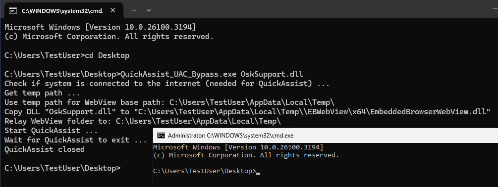

# QuickAssist UAC Bypass

QuickAssist is an application that was introduced in Windows 10 1809. It is an UIAccess binary that is installed by default and can be abused to bypass UAC. Because QuickAssist uses WebView2 for the login mask it can be tricked by the BrowserExecutableFolder group policy to load WebView2 and therefore an attacker-controlled DLL from an arbitrary location. Loading the DLL in QuickAssist process grants high integrity but no administrator permissions.
This seems like a "downgrade" to a normal UAC bypass with auto-elevate at first. Other UIAccess/UIPI bypasses try to take control over elevated windows by sending inputs to them. But this is not necessary. The integrity level allows the use of SetWindowsHookExW() or GetProcessHandleFromHwnd() to take over elevated processes that have a window. If no elevated window exists in the current session, then one could be created by starting an elevated scheduled task. And because no prompts are ever shown on UIAccess programs this makes these kinds of UAC bypasses even better than regular UAC bypasses. This UAC bypass therefore also serves as a PoC to show that any UIAccess bypass can be considered a full UAC bypass. Any previous UAC bypass that can be "downgraded" to an UIAccess bypass can therefore be upgraded to an always notify compatible UAC bypass.

**Works on Windows 10 1809 upwards and Windows 11**
This UAC bypass works with always notify but has some caveats:
 - Works only on clients (not Windows Servers)
 - QuickAssist needs an internet connection. Otherwise WebView2 will not load
 - WebView2 version 87 or later must be installed (needed for QuickAssist)
 - QuickAssist is optional in Windows 11 (but installed by default)

**Usage:**

    Usage: QuickAssist_UAC_Bypass.exe [path_to_dll]
    
    Example: QuickAssist_UAC_Bypass.exe OskSupport.dll

